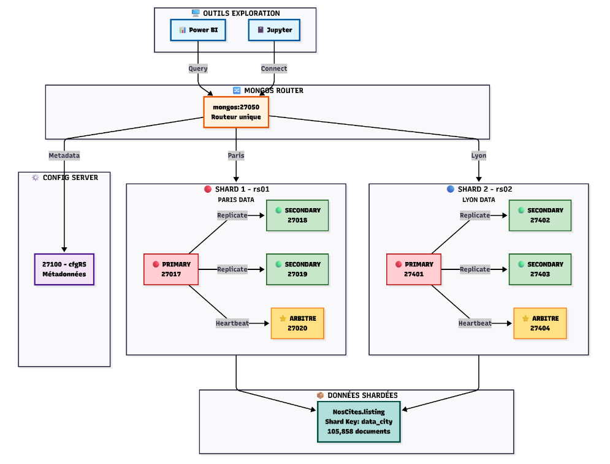

## Context

Ce projet a été réalisé dans le cadre de mon parcours de formation 'Data Engineer' avec OpenClassrooms.

Titre du projet :

`Concevez et analyser une base de données NoSQL`

Ce repo ne concerne que la logique de conception de la base de données, les fichiers de données étant trop volumineux pour github. 

### Source data :

- [listing_paris](https://s3.eu-west-1.amazonaws.com/course.oc-static.com/projects/922_Data+Engineer/922_P7/listings_Paris+(1).csv)

- [listing_lyon](https://s3.eu-west-1.amazonaws.com/course.oc-static.com/projects/922_Data+Engineer/922_P7/listings_Lyon+(1).csv)

## Installations

### MongoDB (Local)

Ce projet utilise **MongoDB** comme base de données NoSQL.

**MongoDB Community Server** :
   - Télécharger depuis [le site officiel](https://www.mongodb.com/try/download/community).

**Outils** :
   - [MongoDB Compass](https://www.mongodb.com/products/compass).
   - [mongosh](https://www.mongodb.com/docs/mongodb-shell/install/?operating-system=windows&windows-installation-method=msiexec)

---

## Architecture MongoDB distribuée

Cluster MongoDB shardé avec :
- ✅ **2 Replica Sets** (rs01 Paris + rs02 Lyon)
- ✅ **8 nœuds MongoDB** + 1 Config Server + 1 Mongos
- ✅ **105,858 documents** shardés par `data_city`
- ✅ **Arbitres** pour haute disponibilité



---

## Structure du projet

```
MongoDB_sharding_cluster/
├── images/MongoDB_Sharding.png
├── README.md                    # Ce fichier
├── setup_cluster.ps1            # Installation complète
├── verify_cluster.ps1           # Vérification
├── stop_cluster.ps1             # Arrêt propre
└── restart_cluster.ps1          # Relance
```

---

## Démarrage rapide

### 1. Lancer le cluster complet
```powershell
.\setup_cluster.ps1
```
⚠️ Changer le chemin d'accès pour les csv (lignes 33 et 37) ⚠️
⚠️ Ce script supprime toutes les databases existantes sur les ports locaux indiqué ⚠️ 

### 2. Vérifier l'installation
```powershell
.\verify_cluster.ps1
```

### 3. Arrêter sans perdre les données
```powershell
.\stop_cluster.ps1
```

### 4. Relancer le cluster
```powershell
.\restart_cluster.ps1
```

---

## Connexion

### Mongos (via routeur)
```
mongodb://127.0.0.1:27050/
```

### Direct rs01 (27017)
```
mongodb://127.0.0.1:27017/?directConnection=true&replicaSet=rs01
```

### Direct rs02 (27401)
```
mongodb://127.0.0.1:27401/?directConnection=true&replicaSet=rs02
```

---


# Tableau 1 : Configuration des Replica Sets

| Étape | Commande / action | Résultat obtenu |
|-------|-------------------|-----------------|
| **Démarrage rs01** | mongod sur 27017, 27018, 27019 | 3 processus actifs |
| **Démarrage rs02** | mongod sur 27401, 27402, 27403 | 3 processus actifs |
| **Initialisation rs01** | rs.initiate({_id: 'rs01', ...}) | Replica Set rs01 créé |
| **Initialisation rs02** | rs.initiate({_id: 'rs02', ...}) | Replica Set rs02 créé |
| **Ajout arbitre rs01** | rs.add({_id: 3, host: '127.0.0.1:27020', arbiterOnly: true}) | 3 nœuds data + 1 arbitre |
| **Ajout arbitre rs02** | rs.add({_id: 3, host: '127.0.0.1:27404', arbiterOnly: true}) | 3 nœuds data + 1 arbitre |
| **Vérification état** | rs.status().members | PRIMARY/SECONDARY/ARBITER |
| **Test réplication** | insertOne(..., {writeConcern: {w: 2}}) | acknowledged: true |
| **Vérification secondaire** | lecture sur 27018/27019/27402/27403 | documents visibles |

---

# Tableau 2 : Configuration du Sharding

| Étape | Commandes / action | Résultat obtenu |
|-------|-------------------|-----------------|
| **Stratégie de distribution** | Shard Key : { data_city: 1, _id: 1 } | Documents distribuables par ville |
| **Démarrage infrastructure** | cfgRS:27100 + mongos:27050 | Config Server + Router opérationnels |
| **Déclaration des shards** | sh.addShard('rs01/127.0.0.1:27017,27018,27019') + sh.addShard('rs02/127.0.0.1:27401,27402,27403') | db.adminCommand({ listShards: 1 }) retourne 2 shards |
| **Activation sharding BD** | sh.enableSharding('NosCites') | Sharding activé sur NosCites |
| **Création index shard** | db.NosCites.listing.createIndex({data_city: 1}) | Index créé sur data_city |
| **Sharding collection** | sh.shardCollection('NosCites.listing', {data_city: 1}) | Collection NosCites.listing shardée |
| **Zones géographiques** | sh.addShardToZone('rs01', 'Paris') + sh.addShardToZone('rs02', 'Lyon') | Paris → rs01, Lyon → rs02 |
| **Distribution automatique** | Balancer enabled + Wait 2-3 min | Paris:~95K sur rs01, Lyon:~10K sur rs02 |
| **Vérification distribution** | sh.status() → shardedDataDistribution | 105,858 documents répartis |

---

# Tableau 3 : Architecture Finale

| Composant | Port | Type | Rôle | État |
|-----------|------|------|------|------|
| **rs01 PRIMARY** | 27017 | Shard Data | Stockage Paris (priority: 2) | 🟢 Active |
| **rs01 SECONDARY** | 27018 | Shard Data | Réplica Paris (priority: 1) | 🟢 Active |
| **rs01 SECONDARY** | 27019 | Shard Data | Réplica Paris (priority: 1) | 🟢 Active |
| **rs01 ARBITRE** | 27020 | Shard Data | Élection rs01 | 🟡 Arbitre |
| **rs02 PRIMARY** | 27401 | Shard Data | Stockage Lyon (priority: 2) | 🟢 Active |
| **rs02 SECONDARY** | 27402 | Shard Data | Réplica Lyon (priority: 1) | 🟢 Active |
| **rs02 SECONDARY** | 27403 | Shard Data | Réplica Lyon (priority: 1) | 🟢 Active |
| **rs02 ARBITRE** | 27404 | Shard Data | Élection rs02 | 🟡 Arbitre |
| **Config Server** | 27100 | cfgRS | Métadonnées cluster | 🟢 Active |
| **Mongos Router** | 27050 | Query Router | Distribution requêtes | 🟢 Active |

---

# Tableau 4 : Données et Stockage

| Replica Set | Données | Documents | Taille | Stockage |
|------------|---------|-----------|--------|----------|
| **rs01 (Paris)** | NosCites.listing | ~95,885 | ~378 MB | /mongo-rs/27017/18/19 |
| **rs02 (Lyon)** | NosCites.listing | ~9,973 | ~42 MB | /mongo-shard/rs02-1/2/3 |
| **Config** | Métadonnées sharding | 1,000+ | ~5 MB | /mongo-shard/cfg01 |
| **TOTAL** | 105,858 documents | 2 shards | ~425 MB | Répartis |

---

# Tableau 5 : Commandes de Vérification

| Action | Commande | Résultat attendu |
|--------|----------|------------------|
| **Vérifier status cluster** | mongosh --port 27050 --eval "sh.status()" | 2 shards actifs, balancer enabled |
| **Vérifier rs01** | mongosh --port 27017 --eval "rs.status()" | 3 data + 1 arbiter, 1 PRIMARY |
| **Vérifier rs02** | mongosh --port 27401 --eval "rs.status()" | 3 data + 1 arbiter, 1 PRIMARY |
| **Compter Paris** | mongosh --port 27050 --eval "db.NosCites.listing.countDocuments({data_city: 'Paris'})" | ~95,885 |
| **Compter Lyon** | mongosh --port 27050 --eval "db.NosCites.listing.countDocuments({data_city: 'Lyon'})" | ~9,973 |
| **Distribution shards** | mongosh --port 27050 --eval "sh.status()" → shardedDataDistribution | Paris sur rs01, Lyon sur rs02 |
| **Connexion Power BI** | mongodb://127.0.0.1:27017/?directConnection=true&replicaSet=rs01 | Connection établie ✅ |
